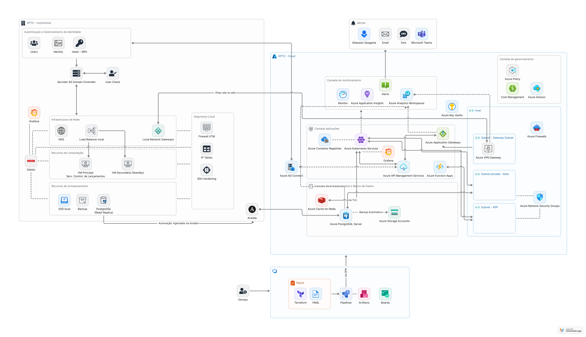

# Arquitetura da Solução Híbrida — XPTO

## Visão Geral

A arquitetura proposta visa modernizar a infraestrutura legada da empresa XPTO, atualmente baseada em ambiente on-premises, migrando para um modelo **híbrido** que aproveita os benefícios de escalabilidade, segurança e resiliência proporcionados pela nuvem.

A solução foi desenhada para suportar os seguintes pilares:

- Alta disponibilidade e performance
- Integração segura entre on-premises e cloud
- Escalabilidade horizontal em períodos de pico
- Redução de custos com práticas FinOps
- Resiliência contra falhas e recuperação rápida

---

## Diagrama de Topologia



> Obs.: O diagrama encontra-se no diretório `diagrama/`.

https://www.onemodel.app/d/z3kyrGSB5VHflEQbrTeDF
---

## Componentes Principais

### On-Premises

- **Serviço de Controle de Lançamentos**
  - Mantido localmente por requisitos de compliance e dados sensíveis.
  - Executado em uma VM com balanceador local (HAProxy/Nginx).
  - Comunicação segura com os componentes em nuvem via VPN e TLS.

### Cloud (Azure)

- **Serviço Consolidado Diário**
  - Hospedado no **Azure Kubernetes Service (AKS)** com autoescalabilidade (HPA).
  - Utiliza **Azure Container Registry (ACR)** para imagens Docker.
  - Exposto via **Azure Application Gateway** com WAF e TLS.

- **Banco de Dados**
  - **Azure PostgreSQL Flexible Server** com alta disponibilidade e backups automáticos.
  - Replicação unidirecional para leitura on-premises (read-replica).
  - Tráfego seguro via TLS.

- **Cache**
  - **Azure Cache for Redis** (gerenciado), integrado via VNet e TLS, para reduzir latência.

- **API Gateway**
  - **Azure API Management (APIM)** controla acesso, roteamento e autenticação (JWT, OAuth).
  - Permite aplicar **políticas de rate limiting, logging e versionamento de APIs**.

- **Serverless**
  - **Azure Function Apps** executam tarefas event-driven (como envio de notificações ou processamento de relatórios).

## Segurança e Acesso

- **VPN Site-to-Site**
  - Interligação segura entre o datacenter local e a nuvem.
  
- **Protocolos Utilizados**
  - SSH para administração de VMs (com bastion host).
  - HTTPS para comunicação entre serviços.
  - TLS mútua em conexões críticas.

- **IAM e RBAC**
  - Controle de permissões granulares nos recursos cloud e Kubernetes.

---

## Integração On-Premises + Cloud

| Recurso             | Local               | Nuvem                    | Comunicação                     |
|---------------------|---------------------|---------------------------|---------------------------------|
| Serviço de Lançamentos | VM local             | —                         | Exposto via Load Balancer local |
| Serviço de Consolidação | —                 | Kubernetes (nuvem)        | VPN + API Gateway               |
| Banco de Dados      | Replica local (read) | Principal (cloud)         | Sincronização e failover        |

---

## Justificativas Arquiteturais

- **Ambiente Híbrido** permite aproveitamento de infraestrutura existente com elasticidade da nuvem.
- **Kubernetes** oferece escalabilidade automática e resiliência.
- **Serverless** reduz custos em tarefas não contínuas.
- **VPN Site-to-Site** mantém comunicação segura e privada.
- **API Gateway** centraliza segurança e controle de tráfego.
- **Redis Cache** melhora a performance de leitura no serviço de consolidação.

---

# Naming Convention — Infraestrutura XPTO

Padronização dos nomes de recursos da infraestrutura híbrida para garantir organização, rastreabilidade, governança e consistência no Azure e no Terraform.

---

## Padrão Geral

- `projeto`: nome base do sistema ou empresa (ex: `xpto`)
- `tipo`: recurso (vnet, aks, db, apim, etc.)
- `ambiente`: dev, stg, prod
- `região`: região Azure (ex: brazilsouth, eastus)
- `identificador`: uso opcional para distinguir instâncias

---

## Exemplo de Nomes por Tipo de Recurso

| Recurso                     | Nome Exemplo                        |
|-----------------------------|-------------------------------------|
| Resource Group              | `rg-xpto-prod-brazilsouth`          |
| Virtual Network             | `xpto-vnet-prod-brazilsouth`        |
| Subnet App                  | `xpto-subnet-app-prod-brazilsouth`  |
| Subnet Data                 | `xpto-subnet-data-prod-brazilsouth` |
| Subnet Gateway              | `xpto-subnet-gw-prod-brazilsouth`   |
| Azure Kubernetes Service    | `xpto-aks-prod-brazilsouth`         |
| PostgreSQL Server           | `xpto-db-prod-brazilsouth`          |
| Redis Cache                 | `xpto-redis-prod-brazilsouth`       |
| Application Gateway         | `xpto-appgw-prod-brazilsouth`       |
| API Management              | `xpto-apim-prod-brazilsouth`        |
| Key Vault                   | `xpto-kv-prod-brazilsouth`          |
| Log Analytics Workspace     | `xpto-logs-prod-brazilsouth`        |
| VPN Gateway                 | `xpto-vpngw-prod-brazilsouth`       |
| Public IP for Gateway       | `xpto-ip-appgw-prod-brazilsouth`    |
| Storage Account (TF State)  | `stxptoinfradev001`                 |

---

## Tags Recomendadas

| Tag           | Valor Exemplo        | Descrição                               |
|---------------|----------------------|------------------------------------------|
| `project`     | `xpto-infra`         | Nome do projeto ou sistema               |
| `env`         | `dev`, `stg`, `prod` | Ambiente da infraestrutura               |
| `owner`       | `infra@xpto.com.br`  | Responsável técnico                      |
| `costcenter`  | `TI-001`             | Centro de custo                          |
| `managed_by`  | `terraform`          | Ferramenta que gerencia o recurso        |

---

## Boas Práticas

- Utilize apenas **letras minúsculas**, números e hífens (`-`)
- Evite nomes longos demais (limite de 80-90 caracteres em alguns recursos Azure)
- Mantenha a convenção em todos os ambientes e automações
- Tags devem ser obrigatórias via `default_tags` no Terraform

---

## Considerações Futuras

- Migração total para cloud em médio prazo.
- Adoção de **service mesh** para observabilidade e segurança intra-serviços (ex: Istio).
- Implementação de **CI/CD completo** com GitOps.
- Substituição das VMs locais por contêineres em ambiente edge/híbrido.

---

## TOPOLOGIA DEVOPS (CI/CD)

```text
Engenheiro DevOps
      │
      ▼
Azure DevOps Pipeline (YAML)
      │
      ├── Terraform Init / Plan / Apply
      │
      ▼
Azure Resource Manager (ARM API)
      │
      └── Provisão de Recursos:
            - VNet
            - AKS
            - PostgreSQL
            - Redis

